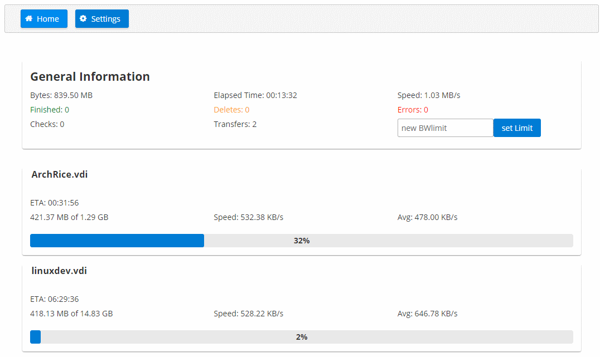

# RcloneWeb

This is a webapp to show stats about rclone running with the `--rc` flag.

It will save your settings in "localstorage" of the current browser, if there are no settings in local storage default settings are loaded.

This app runs only in your browser and connects from your browser to the rclone-demon you tell it to. There are no other connections going on. If you don't trust me, download the repo, build and host your own version.

Currently there is no support for authenticated connection to rclone, so run this only in a secure lan environment.

This will only work if https://github.com/ncw/rclone/issues/2575 is solved. In the mean time use the python proxy available in the /proxy subfolder of this repository.
In the proxy change the ip to your own rclone demon, then connect the webapp to the proxy.
